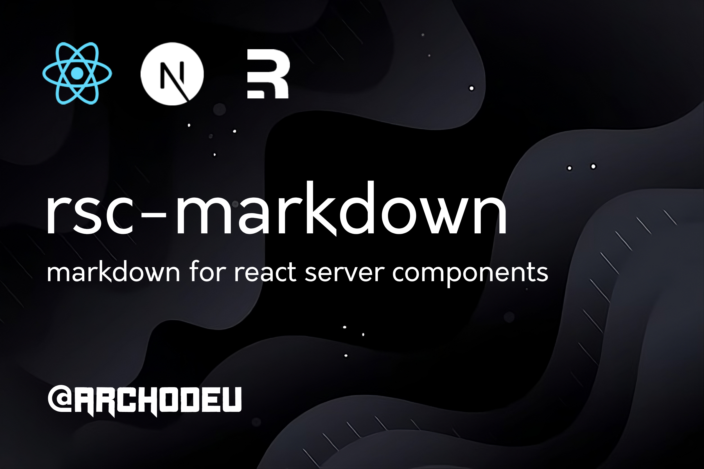

# rsc-markdown

Markdown for server components



---

`rsc-markdown`, a powerful markdown rendering library that supports React Server Components, powered by [`showdown`](https://github.com/showdownjs/showdown) and [`html-react-parser`](https://github.com/remarkablemark/html-react-parser). We provide a powerful server component for rendering markdown content. Compatible with react, nextjs, and remix.

[Next.JS Codesandbox Demo](https://codesandbox.io/p/devbox/rsc-markdown-next-jtc7zp)

**Note**:
If you are using `rsc-markdown` with [tailwindcss](https://tailwindcss.com), it is recommended to also use [@tailwindcss/plugin-typography](https://github.com/tailwindlabs/tailwindcss-typography) because by default tailwind strips all styles off of native html elements, making the markdown content look very plain and like it is just pure text.

## Features

- 🚀 **Server-Side Rendering**: Built for React Server Components, ensuring lightning-fast performance by rendering markdown content directly on the server.
- 🔒 **Safe Rendering**: Converts markdown to jsx without converting using dangerouslySetInnerHtml & sanitizes html with [`xss`](https://github.com/leizongmin/js-xss).
- 📝 **Remark and Rehype Powered**: Utilizes the powerful and flexible parsing and transformation capabilities of remark and rehype.
- 🎨 **Custom Components**: Allows for the substitution of standard markdown elements with custom React components.
- 🔧 **Configurable Options**: Supports options like trimming white space, GitHub Flavored Markdown (GFM), and syntax highlighting for code blocks.
- 🌈 **Syntax Highlighting**: Integrated with rehype-prism-plus for beautiful syntax highlighting in code blocks.
- 📈 **Rendering Support**: `rsc-markdown` is optimized for use with SSG (Static Site Generation), SSR (Server Side Rendering), and CSR (Client Side Rendering).

## Installation

To use **rsc-markdown** in your project, you can install it via npm or yarn:

**npm**:

```bash
npm i rsc-markdown
```

\
**yarn**:

```bash
yarn add rsc-markdown
```

### Props

- `markdown`: (`string`) The markdown content to be rendered. (Required)
- `components`: (`Object`) of custom components to replace standard markdown elements. The key is the default component name and the value is the custom component. (Optional)
  \
   **Example**:

  ```jsx
  const markdown = `
  # Hello World
  This is a paragraph
  `
  <Markdown
    markdown={markdown}
    components={{
      a: MyCustomComponent,
      p: (props) => <p {...props} className="custom-p-class" />
    }}
  />
  ```

- `markdownOptions`: (`Object`) Configuration options for the markdown content. Refer to [showdown](https://github.com/showdownjs/showdown?tab=readme-ov-file#valid-options) for more information. (Optional)
- `parseOptions`: (`Object`) Configuration options for the parsed markdown content. Refer to [html-react-parser](https://github.com/remarkablemark/html-react-parser?tab=readme-ov-file#usage) for more information. (Optional)

## Usage

`rsc-markdown` is designed for Next.js, Remix, and React.

**Server Component**:

```jsx
'use server';

import Markdown from 'rsc-markdown';

const markdownContent = ` # Welcome to rsc-markdown This is a **powerful** library for rendering markdown in React Server Components. `;

function MyComponent() {
  return <Markdown markdown={markdownContent} />;
}
```

**Client Component**:

```jsx
'use client';

import Markdown from 'rsc-markdown';

const markdownContent = ` # Welcome to rsc-markdown This is a **powerful** library for rendering markdown in React Server Components. `;

function MyComponent() {
  return <Markdown markdown={markdownContent} />;
}
```

**With Api**:

```jsx
'use server';

import Markdown from 'rsc-markdown';

export default async function MyComponent() {
  const markdown = await fetch('/api/markdown').then((res) => res.text());

  return <Markdown markdown={markdown} />;
}
```

**With Custom Components**:

```jsx
import Markdown from 'rsc-markdown';

const components = {
  a: ({ href, children }) => (
    <a href={href} style={{ color: 'red' }}>
      {children}
    </a>
  ),
};

const markdownContent = `[Custom Link](https://example.com)`;

function MyComponent() {
  return <Markdown markdown={markdownContent} components={components} />;
}
```

## Contributing

We welcome contributions to **rsc-markdown**! If you find any bugs, please report them. If you would like any new features, we would love your feedback.
